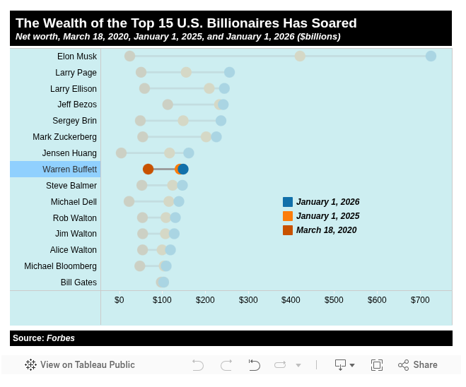

# America’s Wealthiest Are Getting Even Richer - Institute for Policy Studies

> ## Excerpt
> The wealthiest 15 billionaires in America saw their wealth grow over 30 percent in 2025.

---
The top 15 wealthiest people in America are part of a very, very exclusive club: those with over $100,000,000,000 in net worth. After double checking those zeroes, we can confidently say that yes, there are 15 centi-billionaires living among us.

And, according to a new Institute for Policy Studies analysis of data from the _Forbes_ real time [billionaire list](https://www.forbes.com/real-time-billionaires/), the combined wealth of that 12-figure club grew from $2.4 trillion to $3.1 trillion over the course of 2025.

For context, that 30.3 percent rate of growth outpaced both the S&P 500 (16 percent) and billionaires in general (20.8 percent) over the last year. To put it succinctly, the wealthiest Americans are accumulating capital faster than everyone else.

The top 15 wealthiest billionaires aren’t the only ones doing well for themselves. Our analysis found that found that the number of U.S. billionaires increased from 813 with combined wealth of $6.7 trillion at the end of 2024 to 935 U.S. billionaires with combined assets of $8.1 trillion.

The top five wealthiest billionaires all saw huge wealth jumps in 2025.

-   Elon Musk of Tesla/X and SpaceX with $726 billion, up from $421 billion a year ago.
-   Larry Page of Google, with $257 billion, up from $156 billion a year ago.
-   Larry Ellison of Oracle fame with $245 billion, up from $209 billion a year ago.
-   Jeff Bezos of Amazon with $242 billion, up from $233.5 billion a year ago.
-   Sergey Brin of Google with $237 billion, up from $148.9 billion a year ago.

The three wealthiest dynastic families in the U.S. hold an estimated $757 billion, up from $657.8 billion at the end of 2024, a 16 percent gain.  These are:

-   Walton: Seven members of the Walton Family with combined wealth of $483 billion, up from $404.3 billion a year ago.
-   Mars: Six members of Mars family with combined wealth of $120 billion, down from $130.4 billion a year ago.
-   Koch: Two members of Koch family have a combined wealth of $154.8 billion, up from $121.1 billion a year ago.

As we predicted it would at the time, the Covid-19 pandemic drastically accelerated wealth concentration.

On March 18, 2020, for example, Elon Musk had wealth valued just under $25 billion. A little over five years at the end of 2025, Musk’s wealth is $726 billion, a dizzying 2,800 percent increase from before the onset of the pandemic.

Jeff Bezos saw his wealth rise from $113 billion on March 18, 2020 to $242 billion at the end of 2025.

Three Walton family members – Jim, Alice and Rob — saw their combined assets increase from $161.1 billion on March 18, 2020 to $378 billion at the end of 2025.

The extreme concentration of wealth that our continued analysis of billionaires underscores is deeply concerning for the future of our country. These ultra-wealthy individuals have outsized influence on our democratic system — and have actively worked to undermine it. And these spectacular riches comes at the expense of workers, the ones who are actually generating wealth. Social services are being cut while tax burdens are eased on the rich.

Fighting back against wealth concentration will take a two-pronged approach. We have to empower the working class, strengthening unions and improving living conditions. We also have to raise and taxes and close wealth accumulation loopholes, or else billionaire power will only grow.

For press inquiries, contact IPS Deputy Communications Director Olivia Alperstein at [olivia@ips-dc.org](mailto:olivia@ips-dc.org). For recent press statements, [visit our Press page](https://ips-dc.org/press).
