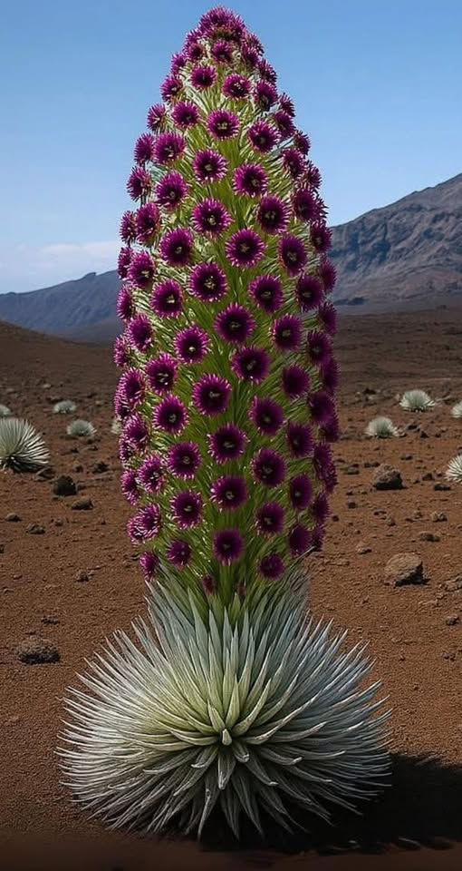

## Opening

I did 't know Carl the way most of you did. The reason you all are here is because you can tell the poignant, funny, sad, unexpected, long-forgotten stories about him. I can't do that. I've only been attending St. Alfred's for a couple of years, and I only know Carl from the time that I became aware that there was this tall well-dressed man who sat in the same seat every week. For the most part, when I extended my hand in greeting, he smiled back warmly and kind of nodded.

Seeing him left me feeling something like "there's a man who is secure in his place in the world. He knows who he is and he's OK with that. He know's where he's come from and he's OK with that. He knows whose he is and where he's headed and he's OK with that.

I want you to know that every time I saw him -- even more when he smiled and nodded as I shared the peace -- I felt a little bit better about myself and my own place in the universe.

Death confronts us with a hard rock of reality. We are mortals and to dust we shall return. The very oldest piece of human writing was an attempt to make sense out of that reality. Basically, it failed to understand it. We can only live it.

Just being in Carl's presence left me feeling that, here is one who has lived it. He knows **who he is and whose he is.**

## Baptism and Resurrection

It was not until I was into my 20's that I had to grapple with the reality of death. (*That's my story and not particularly relevant here.*) One of my teachers at seminary was the first to impress on me that from the perspective of the Church, it's all about the Resurrection. He said whatever the circumstances surrounding a funeral, -- whoever it is, whatever the story, -- he would preach Easter, Baptism, New Life, Restoration, the Community of the Saints … . I've tried to follow that model throughout my ministry

Our prayer book includes this note:

> The liturgy for the dead is an Easter liturgy. It finds all meaning in the resurrection. Because Jesus was raised from the dead, we too, shall be raised.
>
> The liturgy, therefore, is characterized by joy, in the certainty that "neither death, nor life, nor angels, nor principalities, nor things present, nor things to come, nor powers, nor height, nor depth, nor anything else in all creation, will be able to separate us from the love of God in Christ Jesus our Lord."
>
> This joy, however, does not make human grief unchristian. The very love we have for each other in Christ brings deep sorrow when we are parted by death. Jesus himself wept at the grave of his friend. So, while we rejoice that one we love has entered into the nearer presence of our Lord, we sorrow in sympathy with those who mourn.

In the intervening years I have often used the phrase "Who we are and Whose we are" to describe the lifelong process of living into our baptism. That is essentially how I look at life, the life of a Christian in particular, but much more generally the life of the Resurrection, the life of all creation.

In a very long tradition in the church, the Easter candle (_that stands here at the center_) is lit for the first time at Easter and then burns for 50 days throughout the Easter season. A week of weeks, 7 times 7, and a day. Until the Day of Pentecost.

It is lit on 2 other occasions. "Because it's all about Resurrection" after all. It is lit at **baptisms** and at **funerals**.

When I looked at Carl, what I saw and felt was a man who had lived into his baptism. For all of us it takes a lifetime to do that.

## It takes a lifetime

The silversword plant illustrates the principle. I only know about this plant because it is the mascot of the athletic teams of Chaminade University in Honolulu. I taught there for a few years after I retired from parish ministry. The silversword plant blooms but one time in its lifetime. Then it dies.

The Haleakalā silversword, is found only on the high slopes of Maui’s Haleakalā volcano. It is a rare alpine plant that blooms just once in its lifetime. For decades, it waits in silence, its shimmering silver leaves gathering sunlight in the thin mountain air. Then, without warning and only once in its life, it blooms.

According to the National Park Service, this event typically occurs after 20 to 50 years though some may flower as early as 7 years depending on environmental conditions. This final act of beauty lasts only about seven days. And then, having poured every ounce of stored energy into reproduction, the plant dies. It’s a symbol of endurance, timing, and the profound rewards of waiting. In a world driven by urgency, it stands as a quiet reminder: some of nature’s most magnificent displays require a lifetime to unfold.

## In Closing

There was only one Carl ... -- though there are several others here in our midst today. The passing of generations is at the very least a symbol of our connections to one another, connections that transcend all the birthing and passing we experience. It is the **Communion of the Saints**. It is equally the thread that binds us together with all of creation. Funerals are a time when we are especially aware of those connections.

> Time past and time future/ What might have been and what has been /Point to one end, which is always present. _Burnt Norton_, T.S. Eliot

Funerals are above all a **Sacred** time when we recognize and celebrate the life of one of the saints who has completed their own course of life, all the way through to the magnificent blossom that appears at the end. **Silversword.** Saint. Beloved. Father, Son, Grandfather, friend, spouse, ... today, Carl.
