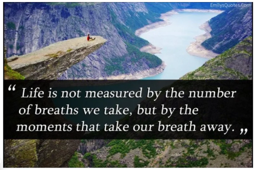

[2025-10-25](../undefined)

**Kiss**

kiss kiss kiss sang the 12 steps\
"Keep it simple stupid"\
kiss kiss kiss rang the razor\
Ockham's ancient offering to rationality.\
*lex parsimoniae*, or "the law of briefness"\
(Wikipedia)

No assurance the simple way is the easy way.\
Yurt\
Encyclopedic of Unknowing

cycle from birth to death\
a circle -- simple\
life built on complexification\
awe and wonder of the creation's multiplicity\
mayonaisse

Zen simplicity\
Purity of the breathingell in meditation

### Concepts and practices:
Simplification:
	: Stripping away unnecessary physical objects and mental clutter to achieve greater clarity and contentment. 

Mindfulness:
	: Focusing on the present moment, such as mindfully eating each bite of a meal or taking full breaks during the workday, says Medium and The Denizen Co.. 

Meditation (Zazen): 
	: A key practice in Zen to quiet the mind, gain insight, and find inner peace. 

Minimalist aesthetic: 
	: A style, often seen in art and design, that emphasizes simplicity and the reduction of nonessentials to find a deeper truth or harmony. 

Daily habits: 
	: Incorporating simple practices like waking up earlier, taking time for oneself, practicing mindful breathing, and being grateful for each day. 

[2025-10-24](../undefined)

## Today

24 7 is all we're given
10 4 is ok in common code
I was born that day 
my first 24 7. 
so many todays have passed this way,
every day today.
27,392 todays have come and gone,
every one today.

what does our today contain?
So many obligations, so many squandered
reveries or stutters,
an occasional secret thought
or glimpse of the bright orange ball over the ocean.
a look in the eyes
we give or receive
noticed with a sly smile.
is it a Lego block to a budding love affair?
Or do we give a quickened, "Thank you?"
to someone or something?
“white book concerning my negotiations with myself—and with God.” 
so Dag Hjalmar Agne Carl Hammarskjöld (1905–1961) 
> "I don't know Who, or what, put the question, I don't know when it was put. I don't even remember answering. But at some moment I did answer Yes to Someone, or Something,and from that hour I was certain that existence is meaningful and that, therefore, my life, in self-surrender, had a goal." ~ Dag Hammarskjold
today.

[2025-10-23](../undefined)

Nonagenarian Carl Reiner mused onced
about his daily ritual reading  the *Obituaries* --
a leftover practice from the nineties,
before newspapers disappeared --
that he did it to discover
whether or not he had died.

Old people are funny, I think,
now that I am one. We get together
and talk about our meds and doctor's appointments.
We imagine that reading 
	graphs, 
	statistical reports,
	starred anomalies,
	WebMD summaries,
	and the like
Gives us the measure of a person.

*Angel Unaware* taught me as a 7 year old
to look for out of the way, unexpected, signs
of humanity's real take.
I'm still on the lookout.

[2025-10-22](../undefined)

**Contemplation & Justice one or two**

Were I born in Papua New Guinea
My world I lay before My god 
To yield to My God's working out
Might not look beyond the nearby shores
Might not be aware of inter-connectedness 
Beyond my boundaries.
I might be more integrated into the whole
Or split between colonialism and primordialism.

Do I see two or one?

Were I raised in Denver Colorado
My horizon stretches up and down and all around
The globe and way beyond. Multi-lingual
Encyclopedic attraction and retraction,
Refraction and exposure lays bare
Exquisite multiplicities. My world lies before God
With broad array.

Do I see two or one?

The two scenes are different. 
Not two but one. 
God's concerns not attached to two but one.
If I bring myself before God
It's not a choice between inner and outer,
It's not two but one.

Some people divide the world into two kinds of people.
And some people don't.

---

[2025-10-21 (1)](../undefined)

Place - timing - input - here I am
Water water private jets roar over
Isaiah - Grace provide for us
And hotter hotter every day
It seems

To me that my
“circumstances are reduced”
Day by day by age alone
But I heard from my son today
It soothes my soul. 

---

